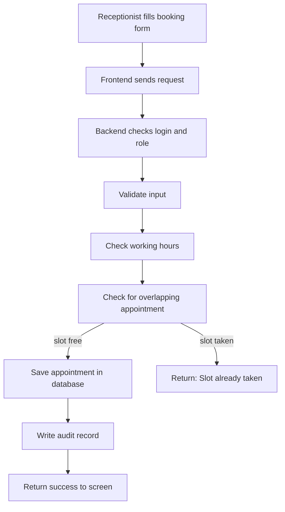

# System Analysis: ClinicFlow

## 1. Inputs and Outputs

| Feature | Inputs | Outputs |
|---|---|---|
| Login | email, password | access token, or "invalid credentials" |
| Add doctor | name, specialization | saved doctor record |
| Set working hours | doctor, weekday, start time, end time | saved working hours |
| Add patient | name, phone | saved patient record |
| Search patient | name or phone text | list of matching patients |
| Book appointment | patient, doctor, date, start time | saved appointment, or error message |
| Cancel appointment | appointment id | status changed to "cancelled" |
| Reschedule | appointment id, new date, new start time | updated appointment, or error (original unchanged) |
| View daily schedule | doctor, date | list of appointments for that day |

## 2. Business Rules
- BR-1: Every appointment lasts a fixed 30 minutes (MVP simplification).
- BR-2: Appointments start only at :00 or :30.
- BR-3: A booking must fall fully inside the doctor's working hours for that weekday.
- BR-4: Two active appointments for the same doctor must never overlap.
  Overlap test: new_start < existing_end AND new_end > existing_start.
- BR-5: Only appointments with status "booked" block a slot. Cancelled ones do not.
- BR-6: Appointments cannot be booked in the past.
- BR-7: Rescheduling is atomic: either the move fully succeeds, or nothing changes.
- BR-8: A completed or no-show appointment cannot be cancelled or rescheduled.
- BR-9: Allowed status changes: booked -> cancelled, booked -> completed, booked -> no-show.
- BR-10: If a doctor's working hours change, existing appointments are NOT deleted.
  Appointments that now fall outside the new hours are flagged for the receptionist to handle.
- BR-11: Admin manages users and doctors. Receptionist manages patients and appointments.
  A doctor can only view their own schedule.

## 3. Data Flow (booking an appointment)

## 4. Main Modules
1. Authentication & Authorization: login, roles, permissions
2. Doctor Management: doctors and working hours
3. Patient Management: add and search patients
4. Appointment Management: book, cancel, reschedule, rules
5. Schedule View: daily schedule per doctor
6. Audit & Logging: who changed what, and error logs

## 5. Dependencies
- Appointment Management depends on Doctor Management, Patient Management, and Authentication.
- Schedule View depends on Appointment Management.
- Audit & Logging is used by all modules.
- Build order: Authentication -> Doctors -> Patients -> Appointments -> Schedule View.

## 6. Risks

| # | Risk | Impact | Mitigation |
|---|---|---|---|
| R-1 | Two users book the same slot at the same moment | Double-booking (breaks the core promise) | Enforce the rule in the database, not only in code; test with simultaneous requests |
| R-2 | Time zone and daylight-saving confusion | Appointments shown at the wrong time | Store times in UTC; convert only for display |
| R-3 | Doctor hours change after bookings exist | Invalid existing appointments | Rule BR-10: flag, never delete |
| R-4 | Unauthorized access to patient data | Privacy breach | Login required, role checks on every endpoint, no real data |
| R-5 | Scope creep (adding reminders, ML too early) | Project never finishes | Protect the MVP list from Phase 2 |
| R-6 | Bugs in rule logic go unnoticed | Wrong bookings | Automated tests for every business rule |
| R-7 | Beginner relying on AI-written code | Can't explain it in interviews | Understanding notes after every feature |